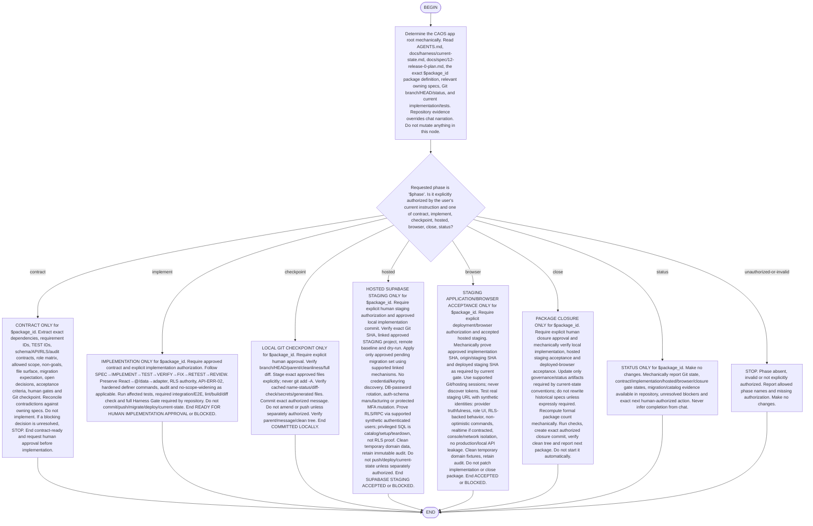

# Flow invariants

- One bounded IMP package at a time.
- Specs/code/tests/Git are authoritative.
- No silent redesign or deferred-scope implementation.
- React → `@/data` → adapter is permanent.
- RLS/server commands authorize; UI hiding does not.
- Authorization before disclosure/lifecycle/replay where required.
- No privileged rank bypass of four-eyes reviewer rules.
- No keyring scraping, secret printing, DB-password rotation, hosted auth-schema
  manufacturing, protected MFA mutation or global audit deletion.
- Production is forbidden unless separately invoked through explicit Release-0
  production gates.
- Never cross a human gate because the prior phase is green.
